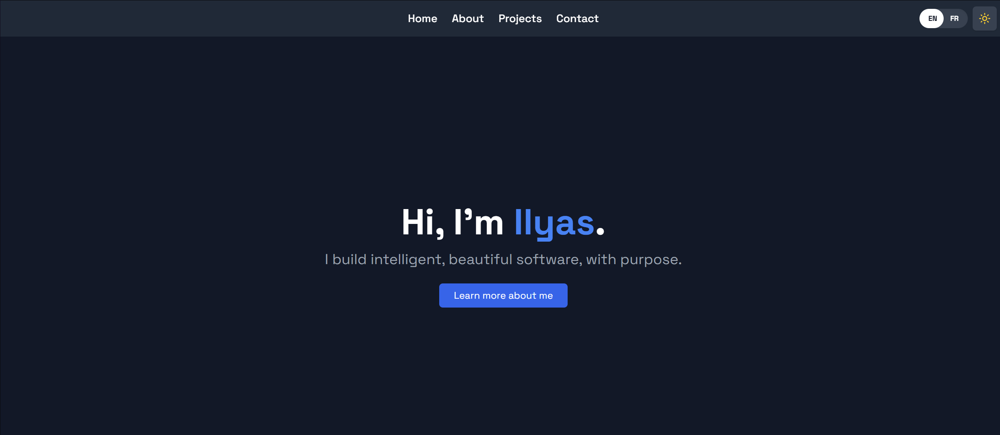

# Personal Portfolio Website

This is my personal developer portfolio built using **React** and **Vite**.  
It showcases my **projects**, **experience**, **resume**, and **contact information** in a clean, bilingual interface (English/French).

---

## Live Demo
[Live Site](https://ilyas-ait-ali-website.netlify.app)



---

## Tech Stack
- **React 19**
- **Vite**
- **Tailwind CSS**
- **Framer Motion**
- **Lucide React**
- **React Router**
- **Deployed via Netlify**

---

## Getting Started (for development)

```bash
npm install
npm run dev
```
Visit http://localhost:5173 in your browser.

---

## License
This project is licensed under the MIT License.
- You are free to use, modify, and distribute this software with minimal restrictions.
- Just retain the original license and disclaimer in any copies or substantial portions of the code.
SPDX-License-Identifier: MIT

---

## Why MIT?
- I chose the MIT License because it reflects the goal of this portfolio:
to share clean, practical, and professional code openly.
- It supports learning, reusability, and contribution without legal friction.
MIT keeps collaboration flexible and frictionless, just like good software should be.

✨ Made with care by Ilyas Ait Ali
